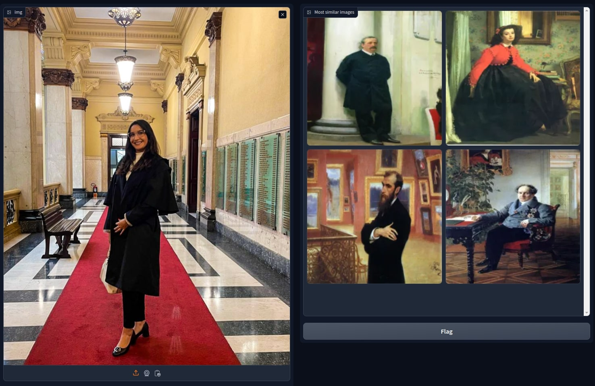

# Image-to-Art Search 🔍

"<b>Find real artwork that looks like your images</b>"

This project fine-tunes a Vision Transformer (ViT) model, pre-trained with "google/vit-base-patch32-224-in21k" weights and fine tuned with the style of [ArtButMakeItSports](https://www.instagram.com/artbutmakeitsports/), to perform image-to-art search across 81k artworks made available by [WikiArt](https://wikiart.org/).


## Table of Contents

- [Overview](#overview)
- [Installation](#installation)
- [How it works](#how-it-works)
- [Dataset](#dataset)
- [Training](#training)
- [Inference](#inference)
- [Contributing](#contributing)
- [License](#license)

## Overview

This project leverages the Vision Transformer (ViT) model architecture for the task of image-to-art search. By fine-tuning the pre-trained ViT model on a custom dataset derived from the Instagram account [ArtButMakeItSports](https://www.instagram.com/artbutmakeitsports/), we aim to create a model capable of matching images (but not only) to corresponding artworks, being able to search for any of the images on [WikiArt](https://wikiart.org/).

## Installation

1. Clone the repository:
```sh
git clone https://github.com/brunorosilva/img2art-search.git
cd img2art-search
```

2. Install poetry:
```sh
pip install poetry
```

3. Install using poetry:
```sh
poetry install
```

## How it works

### Dataset Preparation

1. Download images from the [ArtButMakeItSports](https://www.instagram.com/artbutmakeitsports/) Instagram account.
2. Organize the images into appropriate directories for training and validation.
3. Get a fine tuned model
4. Create the gallery using WikiArt

### Training

Fine-tune the ViT model:
```sh
make train
```

### Inference via Gradio

Perform image-to-art search using the fine-tuned model:
```sh
make viz
```

### Recreate the wikiart gallery
```sh
make wikiart
```

### Create new gallery

If you want to index new images to search, use:
```sh
poetry run python main.py gallery --gallery_path <your_path>
```

## Dataset

The dataset derives from 1k images from the Instagram account [ArtButMakeItSports](https://www.instagram.com/artbutmakeitsports/). Images are downloaded and split into training, validation and test sets. Each image is paired with its corresponding artwork for training purposes, if you want this dataset just ask me stating your usage.

WikiArt is indexed using the same process, except that there's no expected result. So each artwork is mapped to itself and the model is used as a feature extractor and the gallery embeddings are saved as a numpy file (will be changed to chromadb in the future).

## Training

The training script fine-tunes the ViT model on the prepared dataset. Key steps include:

1. Loading the pre-trained "google/vit-base-patch32-224-in21k" weights.
2. Preparing the dataset and data loaders.
3. Fine-tuning the model using a custom training loop.
4. Saving the model to the results folder

## Interface

The recommended method to get results is to use [gradio](https://www.gradio.app/) as an interface by running `make viz`. This will open a server and you can use some image you want to search or even use your webcam to get top 4 search results.

### Examples
Search for contextual similarity


Search for shapes similarity


Search for expression similarity (yep, that's me)


Search for pose similarity


Search for an object


## Contributing
There are three topics I'd appreciate help with:
1. Increasing the gallery by embedding new painting datasets, the current one has 81k artworks because I just got a ready to go dataset, but the complete WikiArt catalog alone has 250k+ artworks, so I really want to up this number to a least 300k in the near future;
2. Porting the encoding and search to a vector db, preferably chromadb;
3. Open issues with how this could be improved, new ideas will be considered.

## License
The source code for the site is licensed under the MIT license, which you can find in the MIT-LICENSE.txt file.

All graphical assets are licensed under the Creative Commons Attribution 3.0 Unported License.